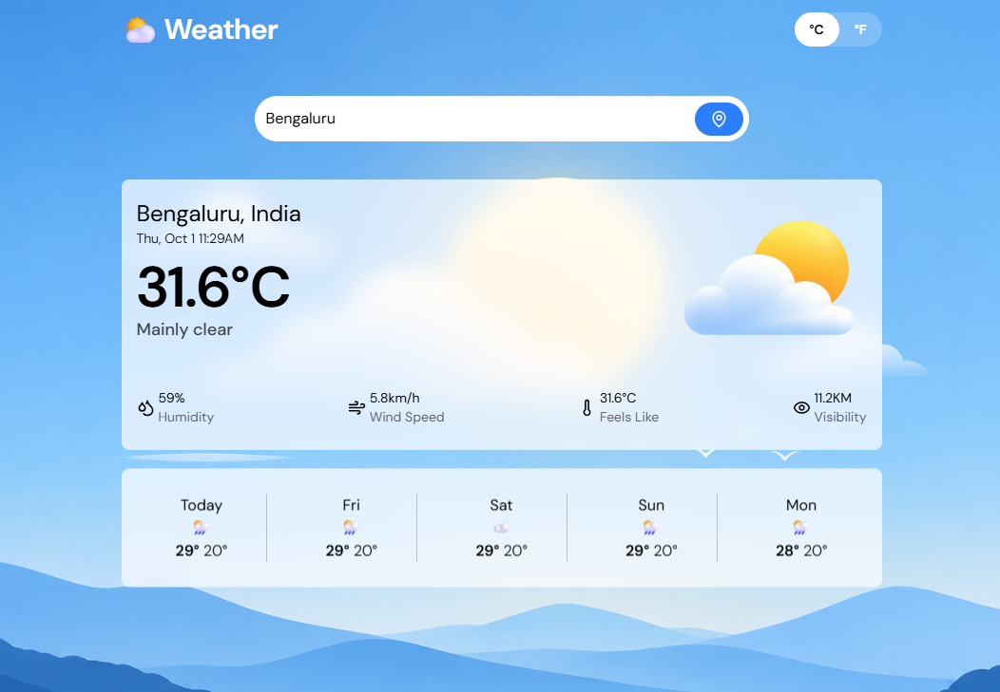

<div align="center">

# 🌤️ Weather App

### A modern and responsive weather forecast application built with React.js

<p>
  
  
  
  
</p>

<br>

<a href="https://weather-forecast-app-one-gold.vercel.app/">
  
</a>

</div>

---

## 📸 Preview

<div align="center">



</div>

---

## ✨ Features

<table>
<tr>
<td width="50%">

### 🌍 City Search

Search for weather information by city name.

</td>

<td width="50%">

### 📍 Current Location

Get weather information using your device's location.

</td>
</tr>

<tr>
<td width="50%">

### 🌡️ Current Weather

View the current temperature and weather condition.

</td>

<td width="50%">

### 📅 5-Day Forecast

View upcoming weather conditions and temperatures.

</td>
</tr>

<tr>
<td width="50%">

### 💨 Weather Details

View humidity, wind speed, visibility and other details.

</td>

<td width="50%">

### 🔄 Temperature Conversion

Switch between Celsius and Fahrenheit.

</td>
</tr>

<tr>
<td width="50%">

### 📱 Responsive Design

Optimized for mobile, tablet and desktop devices.

</td>

<td width="50%">

</td>
</tr>
</table>

---

## 🛠️ Tech Stack

<div align="center">


</div>

---

## 🌐 APIs Used

| API | Purpose |
|---|---|
| 🌤️ Open-Meteo Weather API | Fetch weather data |
| 🌍 Open-Meteo Geocoding API | Search and locate cities |
| 📍 Browser Geolocation API | Detect user's current location |

---

## 🧠 React Concepts Used

```text
⚛️ React Components
🪝 useState
🪝 useEffect
🌐 Context API
🔄 API Requests
📍 Geolocation API
💾 LocalStorage
⚡ Async / Await
🎨 Tailwind CSS
📱 Responsive Design

